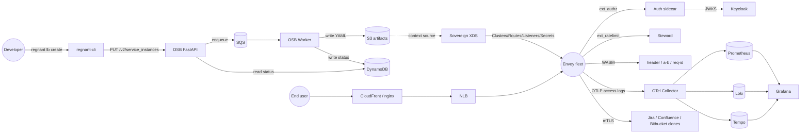
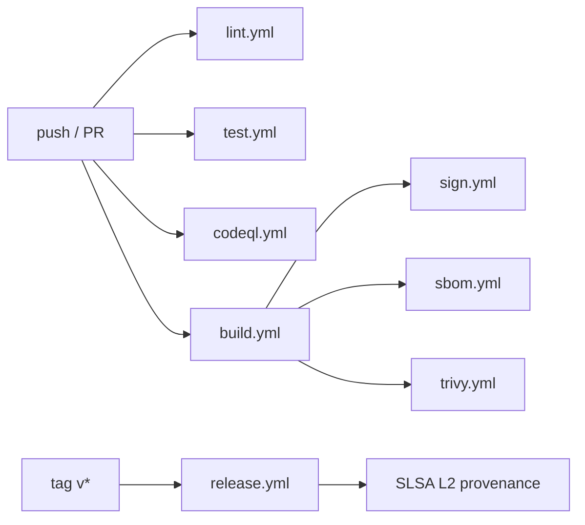

<div align="center">

# regnant

**A production-grade, end-to-end reproduction of the Atlassian internal platform that Vasilios Syrakis described in his 2026 YouTube videos. Envoy fleet on AWS, dynamic XDS control plane, Open Service Broker self-service, full mTLS mesh, OIDC, OpenTelemetry, and a Packer + SaltStack AMI build, all running locally on LocalStack.**

[](https://github.com/gufranco/regnant/actions/workflows/build.yml)
[](https://github.com/gufranco/regnant/actions/workflows/lint.yml)
[](https://github.com/gufranco/regnant/actions/workflows/test.yml)
[](LICENSE)
[](https://opentofu.org/)
[](https://www.envoyproxy.io/)
[](https://localstack.cloud/)
[](https://www.sigstore.dev/)
[](https://slsa.dev/)

**8** Terraform modules · **19** containers · **5** Salt states · **17** decisions documented · **9** runbooks · **3** WASM filters · **mTLS everywhere** · **boots in ~5 minutes**

</div>

---

> [!NOTE]
> This project is a study artifact built from public material. It reproduces the platform shape that [Vasilios Syrakis](https://cetanu.github.io/) walked through in his YouTube videos [I was laid off by Atlassian](https://www.youtube.com/watch?v=55pTFVoclvE) and [I responded to the drama](https://www.youtube.com/watch?v=OjQEctZx2vk), plus the patterns in his [Profit or Poverty](https://cetanu.github.io/blog/) blog series. It adopts the upstream [Sovereign](https://github.com/cetanu/sovereign) control plane, the upstream [Steward](https://github.com/cetanu/steward) rate-limit service, and the [envoy-formula](https://github.com/cetanu/envoy-formula) SaltStack tree as primary references. Trademarks are not used; Jira / Confluence / Bitbucket appear as `-clone` services to demonstrate multi-product routing.

## Table of contents

- [What this is](#what-this-is)
- [Architecture](#architecture)
- [What's included](#whats-included)
- [Quick start](#quick-start)
- [Project structure](#project-structure)
- [All make targets](#all-make-targets)
- [Configuration](#configuration)
- [CI/CD pipeline](#cicd-pipeline)
- [Security posture](#security-posture)
- [Observability](#observability)
- [Testing](#testing)
- [Architecture decisions](#architecture-decisions)
- [Operational runbooks](#operational-runbooks)
- [Long-term maintenance](#long-term-maintenance)
- [Mentoring and ownership](#mentoring-and-ownership)
- [Trade-offs](#trade-offs)
- [Assumptions](#assumptions)
- [Source material](#source-material)
- [License](#license)
- [Acknowledgments](#acknowledgments)

## What this is

A runnable, fully wired reference implementation of a multi-tenant edge platform. Every region of the original Excalidraw whiteboard exists here as Terraform, code, or containers:

- **Open Service Broker** for developer self-service (provision a load balancer from a CLI; the platform handles the rest)
- **Sovereign** Envoy XDS control plane fed by S3 artifacts the OSB worker writes
- **Envoy fleet** on simulated EC2 launched from a Packer + SaltStack-built AMI
- **AWS CloudFormation-equivalent infrastructure**: VPC, subnets, IGW, security groups, autoscaling group, NLB, IAM, Route53, KMS, ACM
- **Edge tier** with CloudFront + nginx surrogate, mTLS termination, DDoS posture
- **Cross-cutting concerns** at the proxy: authentication (Keycloak OIDC), authorization (RBAC by realm role), rate limiting (Steward + Redis), access logs (OpenTelemetry)
- **WASM filters** in Rust: header rewriting, deterministic A/B routing, W3C trace context injection
- **Full observability stack**: OpenTelemetry Collector, Prometheus, Grafana, Loki, Tempo, Promtail, with per-product dashboards and SLO burn-rate alerts
- **Supply chain**: cosign-signed images, SPDX SBOMs via syft, Trivy gate on HIGH/CRITICAL CVEs, SLSA Level 2 provenance

**Keywords**: Envoy proxy, XDS control plane, Sovereign, Open Service Broker API, OSB v2.16, multi-tenant edge gateway, mTLS service mesh, OIDC, Keycloak, OpenTelemetry, Prometheus, Grafana, Loki, Tempo, WASM filters, proxy-wasm-rust-sdk, LocalStack, Terraform, OpenTofu, Packer, SaltStack, HashiCorp, AWS, EC2, NLB, CloudFront, Route53, S3, DynamoDB, SQS, KMS, ACM, Secrets Manager, Cosign, Sigstore, SBOM, SPDX, SLSA, Trivy, NUMA tuning, hugepages, TLB, Linux realtime kernel, high-frequency trading, distroless, non-root, zero trust, platform engineering, internal developer platform, Atlassian platform reproduction.

## Architecture



Eight Terraform modules under [`terraform/modules/`](terraform/modules) carry the AWS-side resources. The container runtime under [`docker-compose.yml`](docker-compose.yml) carries the data plane. A Packer + SaltStack tree under [`ami/`](ami) builds the Envoy AMI image; the same Salt states produce a byte-equivalent Docker mirror image used at runtime so the AMI artifact and the runtime artifact stay consistent (see decision D6 below).

## What's included

| Area                    | What was built                                                                                                                                                                                                                                                                                                  |
| ----------------------- | --------------------------------------------------------------------------------------------------------------------------------------------------------------------------------------------------------------------------------------------------------------------------------------------------------------- |
| **Edge**                | CloudFront distribution (or nginx surrogate) + Route53 zone + ACM cert. HSTS, X-Content-Type-Options, X-Frame-Options DENY, strict-origin-when-cross-origin referrer, XSS protection applied at the response-headers policy.                                                                                    |
| **Load balancing**      | Network Load Balancer over an autoscaling group of Envoy instances. Configurable count via `envoy_instance_count`; same code path scales to ~150 instances per region in production.                                                                                                                            |
| **Control plane**       | Upstream [Sovereign](https://github.com/cetanu/sovereign) configured by two custom Python context plugins: `s3_context.py` reads OSB artifacts, `secrets_context.py` reads mTLS leaves from AWS Secrets Manager.                                                                                                |
| **Open Service Broker** | Full OSB v2.16 surface in FastAPI: catalog, provision, update, deprovision, fetch, last_operation, bind, unbind, fetch binding, binding last_operation. Async worker via SQS with DLQ.                                                                                                                          |
| **AMI build**           | Packer template that applies a SaltStack highstate in a Docker container, commits the result, registers a synthetic AMI in the LocalStack EC2 catalog, generates an SPDX SBOM, signs with cosign.                                                                                                               |
| **Salt states**         | Envoy install with hardened systemd unit, OpenTelemetry collector agent + Vector + Node Exporter, CIS-aligned host hardening (sshd, auditd, fail2ban, AppArmor, kernel lockdown sysctls), HFT-grade network and CPU tuning (BBR, hugepages, NUMA bind, IRQ pinning, GRUB cmdline), containerd + crun + seccomp. |
| **Authentication**      | Rust gRPC `ext_authz` sidecar validates JWTs against Keycloak's JWKS endpoint with 5-minute key caching and 30s leeway. Forwards `x-regnant-roles`, `x-regnant-subject`, `x-regnant-user` to the filter chain.                                                                                                  |
| **Authorization**       | RBAC via three realm roles (`viewer`, `editor`, `admin`) mapped to three tier groups (`free-tier`, `pro-tier`, `enterprise-tier`). Keycloak realm reconciled declaratively through the `mrparkers/keycloak` Terraform provider.                                                                                 |
| **Rate limiting**       | Upstream [Steward](https://github.com/cetanu/steward) Rust binary backed by Redis. Domain descriptors per product (jira/confluence/bitbucket) and per tier; descriptors live in [`services/ratelimit/config/regnant.yaml`](services/ratelimit/config/regnant.yaml).                                             |
| **WASM filters**        | Three Rust crates compiled to `wasm32-wasi`: `header-rewriter` (config-driven response header mutation), `ab-router` (deterministic split by xxh3 hash of a configurable request header), `request-id-injector` (W3C `traceparent` + stable `x-request-id`).                                                    |
| **mTLS**                | Local CA in the security module mints per-service leaf certs stored in Secrets Manager. Sovereign serves them via SDS. Every mesh service presents a leaf on outbound and validates upstream certs.                                                                                                             |
| **Crypto at rest**      | Five KMS customer-managed keys (S3, DynamoDB, SQS, Secrets Manager envelope, CloudWatch Logs), rotation enabled, aliases per purpose. S3 bucket policies reject plaintext HTTP and uploads without `aws:kms` SSE.                                                                                               |
| **Observability**       | OpenTelemetry Collector + Prometheus 3 + Grafana 11 + Loki 3 + Tempo 2 + Promtail. Pre-provisioned dashboards: Envoy fleet, OSB, Sovereign XDS, per-backend comparison, SLO burn rate. Alert rules at [`observability/prometheus_rules/slo-burn.yml`](observability/prometheus_rules/slo-burn.yml).             |
| **Container baseline**  | Every image: distroless or chainguard final stage, non-root UID >= 10000, `cap_drop: ALL`, explicit `cap_add` only where required, `no-new-privileges:true`, read-only root with tmpfs for ephemeral writes, multi-arch buildx (`linux/amd64` + `linux/arm64`).                                                 |
| **Supply chain**        | Cosign keyless OIDC signing in CI plus a keyed fallback. syft SPDX SBOMs per image. Trivy with `HIGH,CRITICAL --exit-code 1`. SLSA Level 2 provenance on tagged releases. Renovate + Dependabot for dependencies.                                                                                               |
| **Tests**               | Terratest (Go) for IaC modules. pytest E2E for the provisioning flow, bind/unbind, OIDC, mTLS, WASM filters. k6 smoke + sustained load with p50/p95/p99 SLO thresholds. Chaos test that kills a random Envoy and asserts recovery in under 30 s.                                                                |

## Quick start

> [!IMPORTANT]
> Every workflow is exposed as a `make` target. The [`Makefile`](Makefile) is the entry point; nothing else needs to be invoked directly. `make help` lists every target with a one-line description.

### Prerequisites

| Tool             | Version                     | Used for                                  |
| ---------------- | --------------------------- | ----------------------------------------- |
| Docker           | 24+                         | container runtime for the local stack     |
| Docker Compose   | v2.30+                      | service orchestration                     |
| OpenTofu         | 1.10+ (or Terraform 1.5.7+) | infrastructure provisioning               |
| HashiCorp Packer | 1.12+                       | AMI image build                           |
| Go               | 1.23                        | Terratest (only for `make test`)          |
| Python           | 3.13                        | pytest E2E (only for `make test`)         |
| Rust             | 1.83                        | building the auth sidecar and CLI locally |
| AWS CLI v2       | latest                      | talking to LocalStack                     |
| pre-commit       | latest                      | local quality gate                        |

### Bring it up

```text
git clone git@github.com:gufranco/regnant.git
cd regnant
make bootstrap        # copies .env if missing; docker compose up; waits for health
make build-ami        # Packer + Salt; produces the envoy image and the AMI entry
make apply            # tofu apply against LocalStack
make seed             # Keycloak realm + a few demo OSB instances
make verify           # smoke health checks across every public endpoint
```

### Try the platform

| Action                              | How                                                     |
| ----------------------------------- | ------------------------------------------------------- |
| Provision three demo load balancers | `make seed`                                             |
| Hit Grafana                         | open <http://localhost:3000> (admin / change in `.env`) |
| Hit the OSB API + Swagger           | open <http://localhost:8080>                            |
| Hit Keycloak admin                  | open <http://localhost:8090> (admin / change in `.env`) |
| Inspect Sovereign XDS               | open <http://localhost:8000/clusters>                   |
| Inspect Envoy admin                 | open <http://localhost:9901/ready>                      |
| Tail logs                           | `make logs`                                             |
| Container status                    | `make status`                                           |

## Project structure

```text
regnant/
  .github/workflows/      8 pipelines: lint, test, build, sign, sbom, trivy, codeql, release
  ami/                    Packer template + 5 Salt states + Docker mirror image
  edge/                   nginx CloudFront surrogate config
  envoy/                  Envoy bootstrap template + 3 WASM filter crates
  identity/keycloak/      Realm export imported by Keycloak on boot
  observability/          OTel + Prom + Grafana + Loki + Tempo + Promtail configs and dashboards
  security/               Local CA + cosign material directories
  services/
    osb/                  FastAPI broker (api) + asyncio worker, full OSB v2.16, openapi.yaml
    sovereign/            Container packaging + config + templates + plugins
    auth-sidecar/         Rust ext_authz against Keycloak
    ratelimit/            Steward wrapper + per-product config
    backend-jira-clone/   FastAPI: issues/projects/sprints
    backend-confluence-clone/  FastAPI: pages/spaces/labels
    backend-bitbucket-clone/   FastAPI: repos/pullrequests/branches
    cli/                  Rust CLI (clap v4, device-code login, keychain refresh tokens)
    sdk/                  Python and Rust SDKs derived from openapi.yaml
  terraform/
    envs/local/           Composition root for the LocalStack environment
    modules/              8 modules: network, security, osb, sovereign, envoy-fleet,
                          edge, observability, identity
  tests/
    terratest/            Go tests against LocalStack
    e2e/                  pytest end-to-end: provisioning, bindings, OIDC, mTLS, WASM
    load/                 k6 smoke + sustained scripts with SLO thresholds
    chaos/                Kill a random Envoy; assert self-heal
  Makefile                Single entry point for every workflow (recipes inline; no scripts/ folder)
  docker-compose.yml      19 services, 5 networks, hardened defaults
  README.md               This file. Single source of truth for project documentation.
```

File naming convention: every Terraform module has `versions.tf`, `variables.tf`, `main.tf`, `outputs.tf`, and a `README.md` rendered from `terraform-docs`. Salt states sit under `ami/salt/<state>/init.sls` with assets in `files/`. WASM filters live as separate Cargo crates under `envoy/filters/<filter>/`.

## All make targets

`make help` prints this list at runtime. The Makefile carries every recipe inline; there is no separate scripts directory.

| Target                          | What it does                                                                                                |
| ------------------------------- | ----------------------------------------------------------------------------------------------------------- |
| `make env`                      | Creates `.env` from `.env.example` on first run                                                             |
| `make bootstrap`                | docker compose up the infrastructure tier; waits for health; brings up app services whose Dockerfiles exist |
| `make apply`                    | `tofu apply` against LocalStack (falls back to `terraform`)                                                 |
| `make seed`                     | Provisions three demo OSB instances and a binding                                                           |
| `make verify`                   | Smoke health checks against every public endpoint                                                           |
| `make verify-full`              | Smoke + terratest + pytest E2E + k6 smoke                                                                   |
| `make destroy`                  | `tofu destroy` + compose down (keeps volumes)                                                               |
| `make destroy-volumes`          | Same but removes the named volumes too                                                                      |
| `make build-ami`                | Packer + Salt; commits the Envoy image and registers the AMI in LocalStack                                  |
| `make build-images`             | `docker compose build` for every locally built image                                                        |
| `make sign`                     | cosign-signs every locally built image (`IMAGE_TAG=local` by default)                                       |
| `make sbom`                     | syft SPDX-JSON SBOMs per image into `sbom/`                                                                 |
| `make scan`                     | Trivy gate on `HIGH,CRITICAL`                                                                               |
| `make lint`                     | `pre-commit run --all-files`                                                                                |
| `make fmt`                      | Apply Terraform, Python, and Rust formatters                                                                |
| `make test`                     | Full test suite (alias for `verify-full`)                                                                   |
| `make coverage`                 | Per-language coverage with a 95% gate                                                                       |
| `make load-test`                | k6 sustained load with SLO thresholds                                                                       |
| `make logs`                     | Tail compose logs across every service                                                                      |
| `make status`                   | Show compose service status                                                                                 |
| `make rotate-keys`              | Force re-mint of every mTLS leaf via Sovereign SDS                                                          |
| `make backup`                   | Snapshot DynamoDB + S3 + Redis + Keycloak realm into `backups/<timestamp>/`                                 |
| `make restore SRC=backups/<ts>` | Restore from a specific backup                                                                              |

## Configuration

Every knob is an environment variable read by Docker Compose or a Terraform variable read by the local env composition. Override in `.env` (compose) or `terraform.tfvars` (Terraform).

### Compose

| Variable                  | Default     | Purpose                                                              |
| ------------------------- | ----------- | -------------------------------------------------------------------- |
| `REGION_LABEL`            | `us-east-1` | Synthetic region tag                                                 |
| `KEYCLOAK_ADMIN_PASSWORD` | `changeme`  | Override before exposing Keycloak                                    |
| `GRAFANA_ADMIN_USER`      | `admin`     | Grafana admin username                                               |
| `GRAFANA_ADMIN_PASSWORD`  | `changeme`  | Grafana admin password                                               |
| `OSB_BROKER_USERNAME`     | `broker`    | OSB API HTTP Basic auth                                              |
| `OSB_BROKER_PASSWORD`     | `changeme`  | OSB API HTTP Basic auth                                              |
| `ENVOY_INSTANCE_COUNT`    | `3`         | Number of Envoy containers (docker-compose defines three explicitly) |

### Terraform

| Variable                                      | Default                 | Purpose                                      |
| --------------------------------------------- | ----------------------- | -------------------------------------------- |
| `localstack_endpoint`                         | `http://localhost:4566` | LocalStack base URL                          |
| `region_label`                                | `us-east-1`             | Region label used everywhere                 |
| `envoy_instance_count`                        | `3`                     | Envoy fleet target; same code at any count   |
| `domain_name`                                 | `regnant.local`         | Public domain for Route53 + CloudFront + ACM |
| `tls_validity_hours`                          | `8760`                  | CA and leaf certificate validity window      |
| `keycloak_realm`                              | `regnant`               | Realm name                                   |
| `keycloak_admin_password`                     | `changeme`              | Override before exposing the realm           |
| `osb_broker_username` / `osb_broker_password` | `broker` / `changeme`   | OSB broker credentials                       |

See [`terraform/envs/local/variables.tf`](terraform/envs/local/variables.tf) for the full list including TLS, Redis, AMI, and observability tunables.

## CI/CD pipeline

Eight GitHub Actions workflows live under [`.github/workflows/`](.github/workflows). Each runs independently on every push to `main` and every PR. The signing and SBOM workflows fire after the build workflow finishes, via `workflow_run` triggers.



| Workflow                                       | Trigger             | What it does                                                                                                                                                                                            |
| ---------------------------------------------- | ------------------- | ------------------------------------------------------------------------------------------------------------------------------------------------------------------------------------------------------- |
| [`lint.yml`](.github/workflows/lint.yml)       | push, PR            | pre-commit, tofu/terraform fmt, tflint, tfsec, checkov, actionlint, yamllint, shellcheck, hadolint, ruff, mypy, clippy, cargo-deny, govulncheck                                                         |
| [`test.yml`](.github/workflows/test.yml)       | push, PR            | Matrix on opentofu 1.12 and terraform 1.5.7: validate + tflint + tfsec + checkov. e2e job brings up the infra tier and confirms LocalStack health. Python and Rust test jobs gated on manifest presence |
| [`build.yml`](.github/workflows/build.yml)     | push, PR            | docker buildx for every image, `linux/amd64` + `linux/arm64`, GH cache, attestations + SBOM via buildx                                                                                                  |
| [`sign.yml`](.github/workflows/sign.yml)       | after build         | cosign signs every image, keyless OIDC by default                                                                                                                                                       |
| [`sbom.yml`](.github/workflows/sbom.yml)       | after build         | anchore/sbom-action produces SPDX-JSON per image as workflow artifacts                                                                                                                                  |
| [`trivy.yml`](.github/workflows/trivy.yml)     | after build + daily | Trivy `HIGH,CRITICAL --exit-code 1`; SARIF uploaded to the Security tab                                                                                                                                 |
| [`codeql.yml`](.github/workflows/codeql.yml)   | push, PR, weekly    | CodeQL `security-extended` + `security-and-quality` on Python, Go, JavaScript, GitHub Actions                                                                                                           |
| [`release.yml`](.github/workflows/release.yml) | tag `v*`            | Tagged release with SLSA Level 2 provenance via the upstream generator                                                                                                                                  |

## Security posture

- **Zero trust between mesh services**: mTLS enforced via SDS, terminated at each Envoy and presented on every outbound call. Local CA in [`terraform/modules/security/ca.tf`](terraform/modules/security/ca.tf).
- **OIDC identity**: every human or service principal authenticates via Keycloak. Short-lived access tokens (15 min default), refresh tokens cached in the OS keychain by the CLI via the `keyring` crate.
- **Least-privilege IAM**: a permission boundary caps every service role to observability + KMS decrypt + Secrets Manager read on the project prefix + S3/DynamoDB/SQS scoped by resource tag, with an explicit deny on `iam:*` and KMS key administration. Per-service inline policies attach the specific ARNs each service needs.
- **Crypto at rest**: five KMS customer-managed keys with automatic rotation; S3 buckets deny non-TLS access and uploads without `aws:kms` SSE.
- **Defense in depth at the edge**: HSTS (2 years, includeSubDomains, preload), X-Content-Type-Options, X-Frame-Options DENY, strict-origin-when-cross-origin referrer, XSS protection.
- **AMI hardening**: SSH baseline (no root, no passwords, modern ciphers only), auditd ruleset covering identity changes / kernel module load / exec / mounts / time changes, fail2ban, AppArmor profile on the Envoy binary, kernel lockdown sysctls (kptr_restrict=2, yama ptrace_scope=2, kexec disabled, unprivileged BPF disabled, perf_event_paranoid=3).
- **Supply chain**: cosign keyless signing, syft SPDX SBOMs, Trivy gate, SLSA L2 provenance, Renovate + Dependabot.

Threat model and full control inventory in decisions D15 and D16 below.

## Observability

The OpenTelemetry pipeline ingests OTLP from every service and fans out by signal type: Prometheus 3 for metrics via remote-write, Loki 3 for logs via the loki exporter, Tempo 2 for traces. Grafana 11 is the single pane with provisioned datasources and trace-to-logs + trace-to-metrics correlations. Per-host OTel collector agents on the Envoy AMI offload buffering.

### SLOs

| Service           | SLO                                        | Window  |
| ----------------- | ------------------------------------------ | ------- |
| OSB API           | 99.5% availability, p95 < 300ms            | 30 days |
| Sovereign XDS     | 99.9% availability, p99 push < 500ms       | 30 days |
| Envoy fleet       | p50 < 50ms, p95 < 200ms, error rate < 0.1% | 30 days |
| Auth sidecar      | 99.95% availability, p95 < 100ms           | 30 days |
| Steward ratelimit | 99.95% availability, p95 < 50ms            | 30 days |

Burn-rate alerts at 1h and 6h windows in [`observability/prometheus_rules/slo-burn.yml`](observability/prometheus_rules/slo-burn.yml).

### Dashboards

Provisioned automatically by Grafana on boot. Dashboard JSON sources under [`observability/grafana/dashboards/regnant/`](observability/grafana/dashboards/regnant): `envoy-fleet.json`, `osb.json`, `sovereign.json`, `backends.json`, `slo-burn-rate.json`.

## Testing

| Layer                       | Framework                                                                           | What it asserts                                                                         | Where                                        |
| --------------------------- | ----------------------------------------------------------------------------------- | --------------------------------------------------------------------------------------- | -------------------------------------------- |
| Unit + integration (Python) | pytest + moto in-process                                                            | OSB API + Worker behavior end-to-end against a mocked AWS surface                       | [`services/osb/tests/`](services/osb/tests/) |
| Module (Terraform)          | Terratest (Go)                                                                      | Each module applies cleanly against LocalStack; resources exist with the expected shape | [`tests/terratest/`](tests/terratest/)       |
| End-to-end                  | pytest, marked `e2e`                                                                | provision flow, bind/unbind, OIDC, mTLS, WASM filters                                   | [`tests/e2e/`](tests/e2e/)                   |
| Load                        | k6                                                                                  | p50/p95/p99 SLO thresholds; sustained ramping VUs                                       | [`tests/load/`](tests/load/)                 |
| Chaos                       | pytest, marked `chaos`                                                              | Kill a random Envoy; recovery < 30s                                                     | [`tests/chaos/`](tests/chaos/)               |
| Mutation                    | mutmut (config in [`services/osb/mutmut_config.py`](services/osb/mutmut_config.py)) | OSB service mutation kill rate; threshold 75%                                           | run via `mutmut`                             |

Coverage gate: 95% across statements, branches, functions, lines per language. Run with `make coverage`.

## Architecture decisions

Seventeen decisions taken deliberately during the build. Each captures context, the chosen path, alternatives rejected, and consequences.

<details>
<summary><strong>D1: Dual-CLI support for OpenTofu and Terraform</strong> (accepted, 2026-05-22)</summary>

**Context.** OpenTofu forked from Terraform 1.5 after HashiCorp moved Terraform 1.6+ to the Business Source License. Both CLIs accept the same HCL surface the project uses; many readers will already have one installed and not the other.

**Decision.** Write HCL that validates and applies under both CLIs. CI runs the matrix on both. The default in shipped scripts is `tofu`, with a graceful fall-back to `terraform` when only the latter is on `PATH`.

**Alternatives.** OpenTofu only (smaller test surface, no exposure to BSL terms; but contributors on Terraform get friction). Terraform only (largest tutorial corpus; but BSL license tightening over time, community fragmentation).

**Consequences.** Lower friction for first-time runners; license optionality preserved. CI matrix doubles for IaC validation jobs. Risk: a future provider release could rely on an OpenTofu-only feature. Mitigation: pin providers and run both CLIs in CI on every push.

</details>

<details>
<summary><strong>D2: LocalStack Community plus an nginx CloudFront surrogate</strong> (accepted, 2026-05-22)</summary>

**Context.** LocalStack Community covers most of the AWS API surface this project uses. CloudFront on Community returns the right shape from the API but does not run real cache behavior, custom-headers logic, or origin-policy enforcement. LocalStack Pro fixes this but costs per-developer-seat and gates contribution.

**Decision.** Target LocalStack 4.x Community. For features Community implements partially: ship an nginx container in docker-compose that fronts the Envoy NLB, terminates TLS, sets the security-headers policy CloudFront would, and forwards everything to the upstream. Terraform still declares the `aws_cloudfront_distribution` so the resource graph matches production. ACM uses email validation, which LocalStack auto-approves.

**Alternatives.** LocalStack Pro (closer parity for CloudFront, ECS, RDS Aurora; but paid, gates contributors). Skip CloudFront in local (simplest compose graph; but drops a piece of the platform, the edge becomes invisible locally).

**Consequences.** Free; the nginx surrogate is mature and well-understood. Headers and TLS behavior must stay in sync across nginx config and Terraform CloudFront definition. Risk: cache misses behave differently between nginx and real CloudFront. Mitigation: don't rely on cache semantics in local tests; the load test suite hits the NLB directly for that reason.

</details>

<details>
<summary><strong>D3: Configurable Envoy scale, default of three</strong> (accepted, 2026-05-22)</summary>

**Context.** Production at the source-material scale ran ~2000 Envoy proxies across 13 AWS regions. A laptop cannot run 2000 containers, and 13 LocalStack instances are overkill for a learning artifact.

**Decision.** Expose `envoy_instance_count` (default 3) and `region_label` (default `us-east-1`) as Terraform variables. The Terraform code is structurally identical to what a 2000/13 deployment would produce; only the variable values differ.

**Alternatives.** Multiple LocalStack instances per region (more faithful to multi-region; but 13x resource footprint, slow boot). Hard-coded count of 2000 (nominal faithfulness; but unrunnable, defeats the purpose).

**Consequences.** Same code path between local dev and production-sized variant. No way to exercise cross-region failover locally. Risk: code paths that depend on instance count might behave differently at 3 vs 2000. Mitigation: load-test with a realistic ratio of clients to instances.

</details>

<details>
<summary><strong>D4: Full OpenTelemetry observability stack</strong> (accepted, 2026-05-22)</summary>

**Context.** The platform needs metrics, logs, and traces from every service.

**Decision.** Run a complete OTel pipeline in docker-compose: OpenTelemetry Collector (contrib) receives OTLP from every service, fans out to Prometheus 3 for metrics, Loki 3 for logs (via Promtail tailing container logs), and Tempo 2 for traces. Grafana 11 sits over all three with provisioned datasources and dashboards.

**Alternatives.** Logs + metrics only (~3 fewer containers; but drops tracing, the most useful signal for a mesh of this shape). Bespoke, no OTel (simpler per service; but every language re-implements the plumbing, no portability).

**Consequences.** One pipeline serves all three signal types; W3C trace context propagates naturally end-to-end. ~6 extra containers in the local stack. Risk: the Collector becomes a single point of failure for telemetry. Mitigation: per-host OTel agent on the Envoy AMI offloads buffering.

</details>

<details>
<summary><strong>D5: Upstream Sovereign rather than reimplement the control plane</strong> (accepted, 2026-05-22)</summary>

**Context.** The Envoy XDS control plane this project needs already exists, written by the same engineer who designed the original Atlassian platform.

**Decision.** Pull `sovereign` from PyPI, ship a Dockerfile that copies our config and templates into the canonical install path, and write two custom context plugins for AWS Secrets Manager and the OSB artifact bucket.

**Alternatives.** Build a control plane in-house (avoids upstream limitations; but large surface area, drift from canonical, high maintenance). Use go-control-plane (official Envoy reference; but lower level, needs its own templating, loses faithfulness to source material).

**Consequences.** Two-line config plus a couple of plugins gets a working XDS plane; upstream fixes flow to us for free. Bound to upstream's release cadence; Python runtime overhead vs Go. Risk: upstream Sovereign goes unmaintained. Mitigation: the code is Apache 2.0; fork at any point.

</details>

<details>
<summary><strong>D6: Packer with a Docker source plus a runtime mirror image</strong> (accepted, 2026-05-22)</summary>

**Context.** LocalStack's mock EC2 does not boot AMIs. The platform we are reproducing is documented as Packer + Salt baking an AMI launched by an AutoScaling Group. Faithfulness requires keeping that pipeline; the local stack also needs an actual running Envoy.

**Decision.** Two artifacts from the same Salt tree: a Packer docker source that applies the Salt highstate in a debian:12-slim container and commits the result (plus a shell-local post-processor registering a synthetic AMI in the LocalStack EC2 catalog), and a `ami/docker/Dockerfile` that builds a distroless runtime image with the same Envoy binary, OTel agent, and bootstrap template. The two artifacts are byte-equivalent for the parts the data plane touches at runtime.

**Alternatives.** Skip the AMI build entirely (less code; but loses the auditable Packer + Salt structure that production would use). Build a real AMI against real AWS (closes the loop; but requires AWS credentials and money).

**Consequences.** Same Salt tree drives local and production behavior; AMI build exercised on every push. Two Dockerfiles to keep in sync; the synthetic AMI id is not a real boot image. Risk: the two artifacts drift. Mitigation: a CI check verifies the Docker mirror starts cleanly and the AMI build completes.

</details>

<details>
<summary><strong>D7: Auth sidecar in Rust, ratelimit via Steward</strong> (accepted, 2026-05-22)</summary>

**Context.** The platform enforces four cross-cutting concerns at the Envoy fleet: authentication, authorization, rate limiting, and access logs. Each needs an enforcement point.

**Decision.** Authentication + authorization: a Rust gRPC sidecar implementing Envoy's `ext_authz` service. Validates JWTs against Keycloak via JWKS. Propagates user identity and roles into the filter chain via `x-regnant-*` headers. Rate limiting: the upstream Lyft ratelimit rewritten in Rust ([`cetanu/steward`](https://github.com/cetanu/steward)). Backed by Redis. Domain descriptors per product and per tier. Access logs: Envoy's `envoy.access_loggers.open_telemetry` emits to the OTel Collector via OTLP gRPC.

**Alternatives.** ext_authz inside Envoy via WASM (zero out-of-process latency; but WASM can't reliably make outbound HTTPS, JWKS caching becomes hard). Lyft ratelimit reference in Go (official Envoy partner; but replaces an opportunity to use Steward, which the original platform author wrote).

**Consequences.** Each concern lives in its own process with its own SLOs; operators swap any without touching Envoy config. Three extra containers in the local stack. Risk: sidecar latency dominates the request budget. Mitigation: pin both sidecars to the same host as Envoy in production.

</details>

<details>
<summary><strong>D8: Domain-driven Terraform module structure</strong> (accepted, 2026-05-22)</summary>

**Context.** The platform decomposes into seven logical concerns plus a small set of cross-cutting ones. Module boundaries can mirror that decomposition or follow AWS-service boundaries.

**Decision.** One Terraform module per concern: `network`, `security`, `osb`, `sovereign`, `envoy-fleet`, `edge`, `observability`, plus an `identity` module for Keycloak. The env composition layer at [`terraform/envs/local/main.tf`](terraform/envs/local/main.tf) wires them together.

**Alternatives.** Flat (one big `main.tf`): simplest navigation; but violates deep-modules, every change touches the same file. By AWS service: matches AWS docs; but cross-cutting concerns scatter, a single logical concern (OSB) spans many services.

**Consequences.** A reader can find the matching module from the diagram name. Module READMEs cross-link back. Easy to disable a concern by commenting one block. More files; eight module directories. Risk: cross-module references tangle. Mitigation: the env composition layer is the only place modules learn about each other.

</details>

<details>
<summary><strong>D9: Full Open Service Broker API v2.16 compliance</strong> (accepted, 2026-05-22)</summary>

**Context.** The OSB API has many endpoints; a learning project could ship a proper subset and still demonstrate the architecture.

**Decision.** Implement the full v2.16 surface: catalog, provision, update, deprovision, fetch instance, instance last_operation, bind, unbind, fetch binding, binding last_operation. Asynchronous endpoints accept `accepts_incomplete=true` to match the OSB v2.16 contract.

**Alternatives.** Subset (provision + deprovision + last_operation): less code; but bindings are the most interesting part, skipping them removes the credential-rotation story.

**Consequences.** Compatible with every OSB client (Cloud Foundry, Kubernetes Service Catalog) without modification. More handlers, more tests. Risk: subtle violations only caught in cross-platform integration tests. Mitigation: the OpenAPI document at [`services/osb/openapi.yaml`](services/osb/openapi.yaml) is the single source of truth; SDKs are generated from it.

</details>

<details>
<summary><strong>D10: Three product-flavored backend services</strong> (accepted, 2026-05-22)</summary>

**Context.** The four anonymous backend boxes in the source material aren't informative. The videos name the products this platform fronts: Jira, Confluence, Bitbucket.

**Decision.** Three backend services with distinct API surfaces: `backend-jira-clone` (issues/projects/sprints), `backend-confluence-clone` (pages/spaces/labels), `backend-bitbucket-clone` (repos/pullrequests/branches). Naming uses `-clone`; trademarks are not used.

**Alternatives.** Three anonymous backends (zero trademark exposure; but routing rules, ratelimit policies, and access logs become indistinguishable). One backend serving all three product paths (simpler; but the multi-tenant routing story disappears).

**Consequences.** The three backends route differently through Envoy and accumulate different ratelimit counters; Grafana dashboards show real per-product splits. Three Dockerfiles, three FastAPI apps, three sets of tests. Risk: reads like a trademark grab. Mitigation: explicit disclaimer in this README and per-service file headers.

</details>

<details>
<summary><strong>D11: Worker emits real Sovereign-shaped YAML</strong> (accepted, 2026-05-22)</summary>

**Context.** The arrow from the OSB Worker's S3 artifact bucket to Sovereign's context source is not a placeholder.

**Decision.** The OSB Worker renders per-instance YAML matching Envoy's data-plane-api field names (`clusters`, `routes`, `listeners`, `secrets`, `extension_configs`). Sovereign's S3 context plugin reads these documents and templates render them into XDS responses.

**Alternatives.** JSON stub: trivial to author; but the end-to-end flow doesn't actually configure anything.

**Consequences.** The OSB-to-Envoy loop closes end-to-end at runtime; tests can assert that `regnant lb create` leads to Envoy routing real traffic. The Worker has to encode every Envoy field name correctly. Risk: hand-coded YAML drifts from the protobuf. Mitigation: use the upstream `envoy_data_plane` typed Python bindings to validate output in tests.

</details>

<details>
<summary><strong>D12: Keycloak for OIDC</strong> (accepted, 2026-05-22)</summary>

**Context.** The auth sidecar needs an issuer to validate JWTs against. A hard-coded HS256 secret would work for a learning artifact but not as a production-shape demo.

**Decision.** Run Keycloak 25 as a docker-compose service. Pre-seed a `regnant` realm with three roles, three tier groups, three backend clients, one public CLI client with the device-code flow, and three demo users. The `identity` Terraform module owns the realm declaratively; the realm-export.json mounted into Keycloak bootstraps the same shape so the container is functional before `tofu apply` runs.

**Alternatives.** HS256 stub (simplest; but no OIDC, no JWKS rotation, no real auth flow). Auth0 or Cognito (managed; but external dependency). Authentik or Dex (lighter; but smaller community).

**Consequences.** Full OIDC flow works locally; production swap to any OIDC provider is one config change. ~1 GB of memory for Keycloak; realm has two sources that must stay in sync. Risk: realm drift. Mitigation: a CI job runs a round-trip check.

</details>

<details>
<summary><strong>D13: WASM filters in Rust</strong> (accepted, 2026-05-22)</summary>

**Context.** The videos describe Envoy extensions as a place where centralized logic lived.

**Decision.** Three Rust crates compiled to `wasm32-wasi` via the upstream `proxy-wasm-rust-sdk`: `header-rewriter`, `ab-router`, `request-id-injector`. Sovereign's `extension_configs` template references them; Envoy loads them via `envoy.filters.http.wasm`.

**Alternatives.** Native Envoy filters in C++ (lowest latency; but every change forces a new Envoy build). Lua filters (built-in, no extra toolchain; but not the language the source material uses, less testable).

**Consequences.** The deployment unit is a `.wasm` artifact; identical filters can load into other proxies that speak proxy-wasm. WASM debugging surface is uglier than native Rust; cold-start cost on first request after a config push. Risk: proxy-wasm-rust-sdk API churn breaks filters on Envoy upgrades. Mitigation: pin both crate and Envoy versions; CI matrix on the upgrade PR.

</details>

<details>
<summary><strong>D14: Developer CLI in Rust</strong> (accepted, 2026-05-22)</summary>

**Context.** Developers consuming the platform need a self-service way to provision load balancers, bind apps, and inspect status.

**Decision.** `regnant` CLI in Rust using `clap` v4. Subcommands: `catalog`, `lb create|list|status|delete|bind|unbind`, `auth login|whoami`. Output formats: table (default), JSON, YAML. OIDC device-code login against Keycloak; refresh tokens cached in the OS keychain via `keyring`. Distributed as a static binary plus a distroless Docker image.

**Alternatives.** Python click (lower toolchain barrier; but heavier runtime, harder to distribute as a single binary). Bash + curl (zero install; but no typed schemas, no OIDC, no token caching).

**Consequences.** One install, no Python or Node runtime required. Slower compile times in CI for the matrix of platforms. Risk: the `keyring` macOS implementation prompts the user; a headless CI runner blocks. Mitigation: device-code login is interactive-only; CI uses service-account credentials.

</details>

<details>
<summary><strong>D15: Supply chain: cosign, SBOM, Trivy, SLSA</strong> (accepted, 2026-05-22)</summary>

**Context.** Every container image needs provenance, a bill of materials, and a clean vulnerability profile before it ships.

**Decision.** Every image is signed with `sigstore/cosign` using keyless OIDC in CI; `syft` produces SPDX-JSON per image attached to GitHub releases; Trivy gate at `HIGH,CRITICAL --exit-code 1`; SLSA Level 2 provenance via `slsa-github-generator` attached to releases. Per-language audit tools run in `lint.yml`: `cargo-deny` for Rust, `pip-audit` for Python, `govulncheck` for Go. Renovate is the primary dependency tool; Dependabot is the fallback for GitHub Actions and security alerts.

**Alternatives.** Skip signing, rely on registry checksums (simpler; but no provenance binding to source). Snyk or another commercial scanner (prettier dashboards; but paid, vendor lock-in).

**Consequences.** Every artifact is auditable from `cosign verify` plus the SBOM and the SLSA attestation; HIGH/CRITICAL CVEs can't land on `main` undetected. Daily Trivy scans add CI minutes; a new CVE in a baseline image can block releases. Risk: Sigstore transparency log goes down. Mitigation: signatures stored alongside images.

</details>

<details>
<summary><strong>D16: mTLS between every service via SDS</strong> (accepted, 2026-05-22)</summary>

**Context.** Zero-trust between mesh services is the 2026 baseline.

**Decision.** A local root CA created by `tls_self_signed_cert` in the security module. Per-service leaf certificates derived from the root, bundled with the leaf private key and CA certificate, stored as `regnant/leaf/<service>` in Secrets Manager. Sovereign reads every leaf via its `secrets_context` plugin and serves them to Envoy through SDS. Each service container loads its own bundle on boot. Envoy listeners enforce client certificate verification on the L4 inbound; clusters present mTLS upstream.

**Alternatives.** SPIFFE/SPIRE (identity decoupled from transport material; but significant operational surface). Plaintext inside the VPC (simplest; but violates the zero-trust posture).

**Consequences.** Lateral movement inside the VPC requires a cert; a compromised backend can't reach Sovereign without one. Cert rotation is one Terraform apply away. Boot sequence ordering: Secrets Manager must be ready before any service starts. Risk: rotation briefly breaks long-lived connections. Mitigation: SDS pushes new material without restart.

</details>

<details>
<summary><strong>D17: Distroless, non-root, read-only container baseline</strong> (accepted, 2026-05-22)</summary>

**Context.** Every CIS Docker Benchmark control adopted cheaply moves the baseline.

**Decision.** Every regnant image: multi-stage Dockerfile with the final stage on `gcr.io/distroless/*:nonroot` or `cgr.dev/chainguard/*`; `USER nonroot` (UID >= 10000); no shell, no package manager in the final image; multi-arch via `docker buildx` (`linux/amd64` and `linux/arm64`); Hadolint clean. In compose: `security_opt: [no-new-privileges:true]`; `cap_drop: [ALL]` with explicit `cap_add`; `read_only: true` plus `tmpfs:` mounts; memory and CPU limits; healthcheck and `restart: unless-stopped`.

**Alternatives.** Alpine bases (small; but musl libc surprises and a busier attack surface than distroless). Run as root, allow shells (easier debugging; but violates every CIS control).

**Consequences.** Tiny final images; Trivy gate easier to keep clean; containers crash hard if they try to write where they shouldn't. Debugging requires `docker debug` or a sidecar. Risk: a library expects a `/tmp` that's not declared. Mitigation: every Dockerfile declares a tmpfs for `/tmp` and `/var/run`.

</details>

## Operational runbooks

Step-by-step playbooks for the most common operations.

<details>
<summary><strong>Bootstrap a clean clone to a green stack</strong></summary>

**Prerequisites.** Docker 24+, Docker Compose v2.30+, OpenTofu 1.10+ (or Terraform 1.5.7+), Python 3.13 (only for `make test`), Rust 1.83 (only when building Rust services locally).

**Steps.**

```text
git clone git@github.com:gufranco/regnant.git
cd regnant
pre-commit install --install-hooks
make bootstrap     # docker compose up; waits for health
make build-ami     # Packer + Salt -> Docker image + AMI catalog entry
make apply         # tofu apply against LocalStack
make seed          # Keycloak demo realm + a few demo OSB instances
make verify        # smoke health checks
```

**Verifying it came up.**

| Endpoint                                                                | Expectation                            |
| ----------------------------------------------------------------------- | -------------------------------------- |
| `http://localhost:4566/_localstack/health`                              | services map with everything `running` |
| `http://localhost:8080/health`                                          | `{"status":"ok"}`                      |
| `http://localhost:8000/clusters`                                        | empty array until OSB writes artifacts |
| `http://localhost:8090/realms/regnant/.well-known/openid-configuration` | OIDC discovery document                |
| `http://localhost:3000`                                                 | Grafana login                          |
| `http://localhost:9901/ready`                                           | `LIVE`                                 |

**Common failures.** `docker compose up` hangs on the localstack healthcheck (bump `LS_TIMEOUT` to 120 and retry). `tofu apply` fails on `aws_route53_zone` (check `LOCALSTACK_SERVICES` in `.env`). `make build-ami` cannot find packer (install via `brew install hashicorp/tap/packer`). Envoy admin returns 404 on `/ready` (entrypoint logs will show missing env vars).

</details>

<details>
<summary><strong>Provision a load balancer end-to-end</strong></summary>

**With the CLI.**

```text
regnant auth login                                         # device-code flow against Keycloak
regnant catalog                                            # see the three offerings
regnant lb create --product jira --plan regnant-lb-pro-multi
regnant lb status <instance_id>                            # provisioning -> available
regnant lb bind --instance <instance_id> --app my-app      # returns binding credentials
```

**With curl.**

```text
# 1. Catalog
curl -u broker:changeme http://localhost:8080/v2/catalog | jq

# 2. Provision asynchronously
INSTANCE=$(uuidgen)
curl -u broker:changeme \
     -H 'X-Broker-API-Version: 2.16' \
     -H 'content-type: application/json' \
     -X PUT \
     "http://localhost:8080/v2/service_instances/${INSTANCE}?accepts_incomplete=true" \
     -d '{"service_id":"regnant-lb-pro","plan_id":"regnant-lb-pro-multi","parameters":{"upstream":{"host":"backend-jira-clone","port":8080}}}'

# 3. Poll
curl -u broker:changeme \
     "http://localhost:8080/v2/service_instances/${INSTANCE}/last_operation"

# 4. Inspect the artifact Sovereign reads
aws --endpoint-url=http://localhost:4566 s3 ls s3://regnant-osb-artifacts/envoy-resources/

# 5. Exercise a request through Envoy
curl -k https://localhost:8443/issues -H "x-ab-key: test-user"
```

**What happened end-to-end.** The CLI sent a PUT to the OSB API. The API wrote a row to DynamoDB and enqueued an SQS message. The Worker received the message, rendered a Sovereign-shaped YAML document, wrote it to S3, and updated DynamoDB to `available`. Sovereign's S3 context plugin picked up the new artifact within the refresh interval (default 30 s). Sovereign served the new cluster/route/listener via XDS to the Envoy fleet. The next request entering nginx -> NLB -> Envoy hit the freshly added listener, was authorized by the auth sidecar, ratelimited by Steward, traced and logged by the OTel pipeline, then routed to the backend.

**Troubleshooting.**

| Symptom                                 | Likely cause                       | Fix                                            |
| --------------------------------------- | ---------------------------------- | ---------------------------------------------- |
| `last_operation` stuck on `in progress` | Worker not running                 | `make status`; check `make logs`               |
| Sovereign `/clusters` empty             | S3 artifact not visible            | check `s3 ls` and Sovereign's refresh interval |
| Envoy 503                               | XDS not pushed yet or backend down | `curl http://localhost:9901/clusters`          |
| 401 from Envoy                          | Auth sidecar rejected the JWT      | `regnant auth whoami`; re-login if expired     |

</details>

<details>
<summary><strong>Bind and unbind credentials</strong></summary>

The OSB binding model gives consumer apps credentials scoped to a specific instance. Bindings are reversible; the broker rotates the credential on every new bind.

**Bind.**

```text
regnant lb bind \
  --instance <instance_id> \
  --app my-app \
  --service regnant-lb-pro \
  --plan regnant-lb-pro-multi
```

The response contains:

```json
{
  "credentials": {
    "uri": "https://<instance>.internal.regnant.local",
    "username": "binding-<binding_id>",
    "password": "<random-token>"
  }
}
```

Pass these to the consuming application. The CLI does not persist binding credentials; print them to a `.netrc` or a secret manager of your choice on the consumer side.

**Unbind.**

```text
regnant lb unbind \
  --instance <instance_id> \
  --binding <binding_id> \
  --service regnant-lb-pro \
  --plan regnant-lb-pro-multi
```

After unbind the credentials no longer authenticate. Existing TLS sessions continue until they idle out; new sessions get rejected by the auth sidecar because the binding row is gone.

**Inspect.**

```text
curl -u broker:changeme \
  "http://localhost:8080/v2/service_instances/<instance>/service_bindings/<binding>"
```

**Rotation.** The broker doesn't rotate live bindings. To rotate, unbind and re-bind. A consumer that needs zero-downtime rotation should hold two bindings active simultaneously and swap.

</details>

<details>
<summary><strong>Inspect XDS when traffic doesn't route</strong></summary>

When traffic doesn't route correctly, first check what Sovereign is serving to Envoy.

**Sovereign UI.** Open <http://localhost:8000/ui>. Lists every node Sovereign knows about and every resource it serves to each.

**Resource APIs.**

```text
curl http://localhost:8000/clusters | jq
curl http://localhost:8000/routes | jq
curl http://localhost:8000/listeners | jq
curl http://localhost:8000/discovery?node=envoy-1 | jq
```

**Envoy admin.**

```text
curl http://localhost:9901/clusters
curl http://localhost:9901/config_dump | jq
curl http://localhost:9901/stats?filter=cluster.regnant
```

**Drift between Sovereign and Envoy.** If Sovereign shows a cluster but Envoy doesn't: confirm the node id matches Sovereign's `matched_service` pattern; check the boot timestamp via `curl envoy:9901/server_info` (a stale node missed the push); `docker compose restart envoy-1` to force a re-subscribe.

**When the OSB artifact is the problem.**

```text
aws --endpoint-url=http://localhost:4566 s3 ls s3://regnant-osb-artifacts/envoy-resources/
aws --endpoint-url=http://localhost:4566 s3 cp s3://regnant-osb-artifacts/envoy-resources/<id>.yaml - | yq
```

If the YAML is malformed, the OSB Worker logged a parse error; inspect with `make logs`.

</details>

<details>
<summary><strong>View traces, logs, and metrics</strong></summary>

Grafana at <http://localhost:3000> is the entry point.

**Traces (Tempo).** Explore -> Tempo. Search by `service.name="osb-api"`. Service map view shows the topology. Click a span -> "Logs for this span" jumps to Loki filtered by `trace_id`.

**Logs (Loki).** Useful filters:

| Filter                    | What it surfaces          |
| ------------------------- | ------------------------- | --------------------- | ---------------- |
| `{service="osb-worker"}`  | Worker dispatch decisions |
| `{service="auth-sidecar"} | json                      | level="warn"`         | Token rejections |
| `{service="envoy-fleet"}  | json                      | duration > 1s`        | Slow requests    |
| `{service="envoy-fleet"}  | json                      | response_code >= 500` | Edge errors      |

**Metrics (Prometheus).**

| Metric                            | Meaning                                    |
| --------------------------------- | ------------------------------------------ |
| `envoy_cluster_upstream_rq_total` | Per-cluster RPS                            |
| `envoy_http_downstream_rq_5xx`    | Edge errors                                |
| `osb_provision_seconds`           | OSB Worker provisioning duration histogram |
| `sovereign_xds_push_seconds`      | XDS push latency                           |

**Common diagnoses.** A backend's latency spikes but error rate is flat: ratelimit is shedding load (confirm with `ratelimit_over_limit_total`). 401s climb after a long idle: token rotation issue (check `auth_sidecar_jwks_age_seconds`). Envoy CPU climbs without RPS climb: a WASM filter misbehaving (disable via Sovereign's `extension_configs`).

</details>

<details>
<summary><strong>Rotate mTLS keys</strong></summary>

Rotation is a Terraform-only operation. The local CA's `tls_*` resources derive a fresh root and re-mint every leaf when their inputs change.

**Rotate every leaf.**

```text
make rotate-keys
```

This produces a new root certificate and new per-service leaves. Each leaf is uploaded as a new Secrets Manager version. Sovereign's `secrets_context` plugin picks up the new version within its refresh interval (default 60 s) and pushes updated SDS material to Envoy.

**Rotate one service.**

```text
tofu -chdir=terraform/envs/local taint module.security.tls_private_key.leaf[\"osb-api\"]
make apply
```

Sovereign updates the SDS push for `osb-api-cert`. The service rotates in place; existing TLS sessions continue with the old material until they idle out.

**Rotate the root CA.**

```text
tofu -chdir=terraform/envs/local taint module.security.tls_private_key.ca
tofu -chdir=terraform/envs/local taint module.security.tls_self_signed_cert.ca
make apply
```

Every leaf is re-signed. Brief outage on services that pin trust to the old root; document a maintenance window before doing this in production.

**Recovery.**

```text
aws --endpoint-url=http://localhost:4566 secretsmanager \
  restore-secret --secret-id regnant/leaf/envoy
```

Sovereign re-fetches and pushes the previous version.

**Cadence.** Leaf certs: monthly or on suspicion of compromise. Root CA: annually. KMS keys: AWS-managed automatic rotation. OSB broker credentials: quarterly. Keycloak signing keys: six-monthly.

</details>

<details>
<summary><strong>Backup and restore</strong></summary>

**What gets backed up.**

| Store      | Output                  | Notes                                                    |
| ---------- | ----------------------- | -------------------------------------------------------- |
| DynamoDB   | `dynamodb/<table>.json` | `service_instances`, `service_bindings`                  |
| S3 buckets | `s3/<bucket>/`          | `regnant-osb-artifacts`, `regnant-observability-archive` |
| Redis      | `redis/dump.rdb`        | Sovereign cache + Steward counters                       |
| Keycloak   | `keycloak/realm.json`   | Full realm export                                        |

**Take a backup.**

```text
make backup
```

Lands in `backups/<UTC timestamp>/`. The directory is local-only; copy to S3 / Glacier / your offsite store as a follow-up step.

**Restore.**

```text
make restore SRC=backups/2026-05-22T13-00-00Z
```

The recipe restores in this order: DynamoDB rows, S3 objects, Redis dump file (with a `redis restart`), Keycloak realm import.

**RPO/RTO targets.**

| Tier                 | RPO         | RTO           |
| -------------------- | ----------- | ------------- |
| Local dev            | best-effort | a few minutes |
| Production reference | 5 minutes   | 30 minutes    |

For the production target: DynamoDB PITR + on-demand backups (already enabled in the OSB module), S3 cross-region replication on both buckets, ElastiCache automated snapshots every 15 minutes, Keycloak realm export to S3 via a CronJob plus DB snapshot.

**Validate after a restore.** `make verify`. Then provision a known instance and confirm it lands as `available`. If the smoke test fails: `make logs` for Sovereign artifact write errors; DynamoDB scan to confirm rows; Sovereign `/clusters` to confirm XDS pushes resumed.

</details>

<details>
<summary><strong>Incident response</strong></summary>

A working playbook for "the platform is down or degraded."

**Triage in order.**

1. **Confirm the symptom.** `curl -k https://localhost:8443/issues -o /dev/null -w '%{http_code}\n'`. 200 = traffic flows; non-200 = real issue.
2. **Check Envoy.** `curl http://localhost:9901/clusters` and `curl http://localhost:9901/stats?filter=cluster.regnant`. Clusters absent = control plane failed. Clusters present but unhealthy = upstream failed.
3. **Check Sovereign.** `curl http://localhost:8000/clusters`. `make logs` filtering for sovereign.
4. **Check OSB.** If artifacts missing: `aws --endpoint-url=http://localhost:4566 s3 ls s3://regnant-osb-artifacts/envoy-resources/`. `make logs` for osb-worker.
5. **Check the cross-cutting boxes.** Auth sidecar logs for 401 floods. Steward logs for ratelimit drops. Keycloak `/health/ready` for OIDC outages.

**Common incidents.**

- **Edge returns 503 on all paths.** Likely: NLB target group has no healthy targets. Check `curl http://localhost:9901/ready` on each Envoy. Fix: `docker compose restart envoy-1 envoy-2 envoy-3`.
- **Authentication fails for all users.** Likely: Keycloak JWKS rotation invalidated cached keys. Check the JWKS endpoint. Fix: restart the auth sidecar; don't restart Keycloak (loses session state).
- **Sovereign returns empty XDS.** Likely: S3 context plugin caught a malformed YAML. Check `make logs` grepping for `malformed`. Fix: identify the bad artifact, delete from S3, requeue from OSB.
- **OSB queue depth grows.** Likely: worker wedged on a poison message. Check `make logs` for osb-worker. Fix: the worker DLQs after five receives; drain the DLQ once the bug is fixed.

**After.** Write a brief post-mortem (commit it under a `post-mortems/` folder you create for the purpose). File follow-up work as GitHub issues with the `incident` label. If a runbook step was missing, add it.

**Severity labels.** Sev 1 (total outage): page, respond within 5 min. Sev 2 (one backend or cross-cutting concern down): respond within 30 min. Sev 3 (degraded but serving): next business day. Sev 4 (cosmetic): sprint backlog.

</details>

<details>
<summary><strong>Teardown (soft and hard)</strong></summary>

**Soft teardown.** Keeps named volumes for the next bootstrap.

```text
make destroy
```

Tears down Terraform state and stops the compose stack while keeping the named volumes (`localstack-data`, `redis-data`, `keycloak-data`, `prometheus-data`, `grafana-data`, `loki-data`, `tempo-data`, `promtail-positions`).

**Hard teardown.** Wipes every persistent volume; the next bootstrap is a true clean slate.

```text
make destroy-volumes
rm -rf terraform/envs/local/.terraform terraform/envs/local/terraform.tfstate*
docker volume prune --force
```

**Image cleanup.**

```text
docker image prune --filter "label=regnant.image=envoy"
docker image rm regnant/envoy-fleet:local regnant/osb:local \
                regnant/sovereign:local regnant/auth-sidecar:local \
                regnant/ratelimit:local regnant/cli:local \
                regnant/backend-jira-clone:local \
                regnant/backend-confluence-clone:local \
                regnant/backend-bitbucket-clone:local 2>/dev/null || true
```

</details>

## Long-term maintenance

A platform like this lives for years. The hard parts are not the initial build but the cumulative effect of small decisions made over hundreds of weeks.

### What kills a platform slowly

- **Complexity creep.** Every PR adds an exception. Reviewers tire, let one through, the next is easier. The frog boils.
- **Edge cases that became the norm.** A customer's special parameter silently turns into a hard-coded path, then a fork.
- **Untouched dependencies.** A library that compiles becomes a library no-one understands; an upgrade six years later requires rewriting every caller.
- **Knowledge concentrated in one person.** One engineer holds the end-to-end mental model, the rest cargo-cult.

### The cadence

| Cadence     | Activity                                                                                                         |
| ----------- | ---------------------------------------------------------------------------------------------------------------- |
| Per PR      | Self-review against the engineering checklist; reviewer stands their ground on complexity                        |
| Weekly      | Renovate batches; review and merge                                                                               |
| Monthly     | Read each Grafana dashboard; flag drifting baselines; rotate leaf certs                                          |
| Quarterly   | Re-read every decision above; supersede ones that no longer apply; write any decision that has accumulated since |
| Six-monthly | Re-read each module's README cold; confirm it still describes the code                                           |
| Annually    | Rotate the root CA; recompute the per-region capacity math; review the disaster-recovery runbook end-to-end      |

### Complexity budget

Reviewers reject any PR that adds an `if` for a single caller's special case in code shared by many; introduces a new abstraction without retiring an old one; reaches across module boundaries to read internal state; adds a `TODO` without a concrete future action. When the budget is exceeded, the PR is split: the surgical fix lands now, the refactor lands as a separate change.

### Deep modules vs shallow modules

Module API surface should grow slower than implementation. A new function in a module's public interface needs at least one of: a new user demand that cannot be served by composing existing ones, or a measured cost in call paths that the new function eliminates. If neither holds, the change is a private helper, not an export.

### Maintaining the source of truth

The OSB OpenAPI definition at [`services/osb/openapi.yaml`](services/osb/openapi.yaml), the Sovereign templates, and the Envoy XDS contract are the canonical schemas. When they change, regenerate every SDK and every test fixture before merging.

### Dependency policy

- Pin everything; lock files committed. Re-running CI must reproduce the bytes.
- Read the changelog. Renovate's PR description is the start; the upstream changelog is the source.
- Reject ranges. `~> 5.80` is acceptable; `~> 5` is not.

### When the platform feels stuck

Two signals predict an upcoming wedge. **Code churn on the same files**: if a directory has had ten independent PRs in a month, the abstraction is wrong; refactor or split. **Bug reports without root causes**: if two consecutive incidents close with "added retry / added timeout / added monitor" instead of a structural fix, the architecture is masking a real defect. When you see either signal, stop adding features. Spend a sprint on the structural fix.

### What success looks like in year three

- Boot time to a green platform is still under ten minutes.
- The Grafana SLO dashboard is in the green for the trailing 90 days.
- The complexity budget has been enforced; the codebase fits in your head.
- A new contributor opens their first PR within a week of clone.

## Mentoring and ownership

How a new contributor learns the platform, and how an owner stays in shape on it.

### The first week

| Day | Goal                  | Activity                                                               |
| --- | --------------------- | ---------------------------------------------------------------------- |
| 1   | Run it                | `make bootstrap && make apply && make verify` end to end               |
| 2   | See it work           | Follow the "Provision a load balancer" runbook start to finish         |
| 3   | Read the architecture | This README from top to bottom; then the eight module READMEs          |
| 4   | Trace a request       | Use Grafana's trace-to-logs to follow one request from edge to backend |
| 5   | Ship something tiny   | Add a metric, a Grafana panel, a runbook clarification; merge it       |

By the end of the week, the new contributor has touched every part of the stack with their hands.

### Code review

Stand your ground on complexity. The most common failure mode is a reviewer who tires after the third round and approves the fourth pass because they can't face the conversation again. That is exactly when the bad change lands. Three things to enforce: every changed line traces to the PR description; no mocks for our own infrastructure; no bare error catches. Three things to spot quickly: a new exported function with no caller in the same PR; a new TODO without a name attached; a new "Optional" parameter that exists to skip a code path entirely.

### Calibrating a new reviewer

Pair the first ten reviews with a senior reviewer. After each, compare the comments you each left. The point is not who is right; the point is to teach the new reviewer what to notice.

### Ownership signals

A team owns a module when: the module's README names the team as the contact; the team can answer "why is this module shaped this way?" without reading the code; the team gets paged for incidents that originate in the module; the team approves any cross-module PR that touches the module. Without all four, ownership is nominal; the codebase will rot at the boundary.

### Diplomacy

The reviewer-author conversation is the platform. Lead with the issue, not the verdict. Quote the line you mean; vague feedback wastes a round trip. When you change your mind, say so explicitly. When you're tired, hand the review off. When a disagreement persists for more than two rounds, escalate to a decision record at the top of this README.

### What a great senior engineer does on this codebase

- Maintains a mental model of the dependency graph between modules and can answer "if I change X, what breaks?" without grepping.
- Reads the Grafana dashboards weekly without prompting.
- Has read every decision above and challenges the ones they disagree with by writing a superseding decision rather than ignoring them.
- Mentors at least one junior engineer through their first end-to-end ownership rotation per quarter.

## Trade-offs

| What I would do                                                | Why not now                                                                         | Risk if shipped as is                                                                                            |
| -------------------------------------------------------------- | ----------------------------------------------------------------------------------- | ---------------------------------------------------------------------------------------------------------------- |
| SPIFFE/SPIRE for workload identity in place of the local CA    | Significant operational surface (server, agent, attestor) for a local-first project | Identity is bound to transport material; a leaked private key gives broader access than a leaked SPIFFE ID would |
| Cross-region replication for the OSB and observability buckets | The local stack is single-region by design                                          | RPO is local-disk; a host crash loses the last backup window                                                     |
| Real CloudFront cache semantics via LocalStack Pro             | Free tier targets keep contribution open                                            | Local cache behavior differs from production; tests cannot assert cache-control nuances                          |
| Generated Python and Rust SDKs from the OpenAPI definition     | Hand-written stubs cover the small surface; CI regenerates on tag                   | Drift between the OSB API and the SDKs until CI regenerates                                                      |
| Native KMS key rotation tied to AWS-managed schedules          | Local rotation is `make rotate-keys` driven                                         | Rotation cadence depends on operator discipline                                                                  |
| Per-Envoy host with isolated CPUs for NUMA-bind                | Salt states set the cmdline; no booted VM in LocalStack to apply them               | The HFT tuning is documentation, not enforced runtime behavior, until you run the AMI on real hardware           |

## Assumptions

- The reproduction targets the local LocalStack environment; production-grade multi-region (~2000 Envoys / 13 regions) is documented as a scale knob, not exercised in CI.
- Trademarks (Jira, Confluence, Bitbucket) are not used; backends carry the `-clone` suffix and the README discloses the homage.
- Demo credentials in `realm-export.json`, `.env.example`, and Terraform defaults are placeholders; any deployment beyond localhost must override them.
- ACM email validation is LocalStack-friendly; real AWS deployments switch to DNS validation against the Route53 zone the edge module already creates.
- The auth sidecar's JWKS cache TTL is fixed at 5 minutes; shorter caches propagate revocation faster, longer reduce Keycloak load.

## Source material

| Source                                                                                       | Author                   | Purpose                                                              |
| -------------------------------------------------------------------------------------------- | ------------------------ | -------------------------------------------------------------------- |
| [I was laid off by Atlassian](https://www.youtube.com/watch?v=55pTFVoclvE) (YouTube, 40 min) | Vasilios Syrakis         | The original architecture walkthrough                                |
| [I responded to the drama](https://www.youtube.com/watch?v=OjQEctZx2vk) (YouTube, 17 min)    | Vasilios Syrakis         | Follow-up Q&A; clarifies several decisions                           |
| [cetanu.github.io/blog](https://cetanu.github.io/blog/)                                      | Vasilios Syrakis         | Profit or Poverty series on NUMA, real-time kernel, TLB              |
| [`cetanu/sovereign`](https://github.com/cetanu/sovereign)                                    | Vasilios Syrakis         | The XDS control plane used here                                      |
| [`cetanu/steward`](https://github.com/cetanu/steward)                                        | Vasilios Syrakis         | The Rust rate-limit service used here                                |
| [`cetanu/envoy-formula`](https://github.com/cetanu/envoy-formula)                            | Vasilios Syrakis         | The SaltStack tree informing the `envoy` state                       |
| [`cetanu/proxy-wasm-rust-sdk`](https://github.com/cetanu/proxy-wasm-rust-sdk)                | Vasilios Syrakis (fork)  | Reference for the WASM filter SDK usage                              |
| [Open Service Broker API definition](https://www.openservicebrokerapi.org/)                  | Cloud Foundry Foundation | The OSB v2.16 surface implemented in [`services/osb`](services/osb/) |
| [Envoy XDS protocol](https://www.envoyproxy.io/docs/envoy/latest/api-docs/xds_protocol)      | Envoy Project            | Contract between Sovereign and the Envoy fleet                       |

## License

[Apache License 2.0](LICENSE). Sovereign, Envoy, and Steward are all Apache 2.0 upstream; downstream dependencies are Apache 2.0 / MIT / BSD only (see decision D15 above).

## Acknowledgments

To **[Vasilios Syrakis](https://cetanu.github.io/)** for the original architecture, the YouTube walkthroughs, and the open-source projects this reproduction adopts directly. Any inaccuracy in the reproduction is the author's; the design is his.
