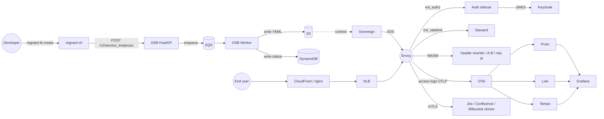

# regnant

State-of-the-art reproduction of the Atlassian platform canvas drawn by [Vasilios Syrakis](https://cetanu.github.io/) in his 2026 layoff and follow-up videos. Reproduces the Open Service Broker, the Sovereign Envoy XDS control plane, the Envoy fleet on EC2 (with AMI built by Packer + SaltStack), the AWS edge tier, the observability stack, and three product-flavored backends, all running locally on LocalStack + Docker Compose.

## Architecture



## Quickstart

```bash
git clone git@github.com:gufranco/regnant.git
cd regnant
pre-commit install --install-hooks
make bootstrap        # docker compose up; wait for health
make build-ami        # Packer + Salt + cosign + SBOM + Trivy
make apply            # tofu apply (terraform apply also supported)
make seed             # Keycloak realm + demo data
make verify           # smoke + e2e
make load-test        # k6 sustained, SLO assertions
```

Then inspect:

- Grafana: http://localhost:3000
- OSB API + Swagger: http://localhost:8080
- Keycloak admin: http://localhost:8090
- Sovereign clusters: http://localhost:8000/clusters
- Envoy admin (localhost-only): http://localhost:9901

Try the CLI:

```bash
regnant catalog
regnant lb create --plan regnant-lb-pro --product jira-clone
regnant lb list
regnant lb bind --instance <id> --app my-app
```

## What this is

A faithful reproduction of every region of the Excalidraw canvas, with state-of-the-art security, supply-chain, and observability baselines layered on top. See `docs/ARCHITECTURE.md` for the region-by-region mapping back to the original source material.

## What this is not

Production-ready as-is. The local stack uses self-signed certs, demo credentials, and LocalStack's mock AWS surface. The `docs/SCALE.md` document explains how to move from default 3 Envoys to 2000-across-13-regions on real AWS.

## Documentation

| Document | Purpose |
|----------|---------|
| `docs/ARCHITECTURE.md` | Canvas region to Terraform module mapping |
| `docs/SCALE.md` | Default 3 to 2000 / 13-region scaling |
| `docs/SECURITY-POSTURE.md` | Zero-trust, mTLS, RBAC, CIS controls |
| `docs/SUPPLY-CHAIN.md` | Cosign + SBOM + Trivy + SLSA + Renovate |
| `docs/OBSERVABILITY.md` | Dashboards, SLOs, runbooks |
| `docs/LONG-TERM-MAINTENANCE.md` | Owning the platform over years |
| `docs/MENTORING-AND-OWNERSHIP.md` | Onboarding and code review playbook |
| `docs/adr/` | Architecture Decision Records (17 entries) |
| `docs/runbooks/` | Bootstrap, provision, bind/unbind, rotate-keys, backup/restore, incident response, teardown |

## Source material

The canvas, transcripts, and OCR are not vendored here. They live in the sibling research folder (`../specs/atlassian-research/`) and the per-video extraction folders (`../specs/atlassian-layoff-video/`, `../specs/atlassian-drama-response/`).

## License

[Apache License 2.0](./LICENSE).

## Acknowledgments

- [Vasilios Syrakis](https://cetanu.github.io/) for the original platform design and for open-sourcing [Sovereign](https://github.com/cetanu/sovereign), [Steward](https://github.com/cetanu/steward), [envoy_data_plane](https://github.com/cetanu/envoy_data_plane), and the [envoy-formula](https://github.com/cetanu/envoy-formula) Salt formula.
- [Atlassian](https://www.atlassian.com/) for hosting the original architecture publicly via the Sovereign documentation.
- [Envoy](https://www.envoyproxy.io/), [LocalStack](https://localstack.cloud/), [HashiCorp](https://www.hashicorp.com/), and [SaltStack](https://saltproject.io/) for the upstream projects this build composes.
