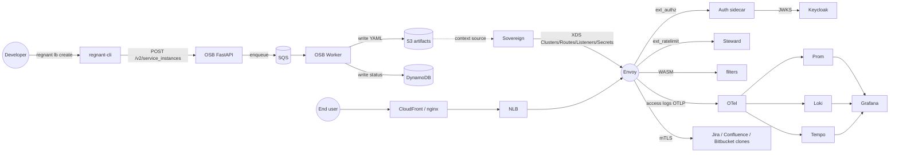

# Architecture

End-to-end flow:

## Module map

Seven Terraform modules plus an identity module compose the platform.

| Concern | Module | What it provisions |
|---------|--------|--------------------|
| Networking | [`terraform/modules/network`](../terraform/modules/network) | VPC, subnets, IGW, endpoints |
| Crypto + IAM + edge cert | [`terraform/modules/security`](../terraform/modules/security) | KMS keys, local CA, leaf certs, IAM roles, ACM, security groups |
| Open Service Broker storage | [`terraform/modules/osb`](../terraform/modules/osb) | S3 artifact bucket, DynamoDB instances + bindings tables, SQS queues with DLQs |
| Sovereign control plane | [`terraform/modules/sovereign`](../terraform/modules/sovereign) | SSM parameters consumed by the Sovereign container, IAM read policy |
| Envoy fleet | [`terraform/modules/envoy-fleet`](../terraform/modules/envoy-fleet) | Launch template, ASG, NLB, target group, instance profile |
| Public edge | [`terraform/modules/edge`](../terraform/modules/edge) | Route53 zone, CloudFront distribution, cache + headers policies |
| Observability | [`terraform/modules/observability`](../terraform/modules/observability) | Log archive bucket, CloudWatch log groups, per-service IAM |
| Identity | [`terraform/modules/identity`](../terraform/modules/identity) | Keycloak realm, roles, groups, clients, demo users |

The AMI build pipeline lives outside Terraform under [`ami/`](../ami):
Packer + SaltStack produce the Envoy fleet image plus a Docker mirror
used by docker-compose.

## Service map

| Service | Image | Language | Replicas |
|---------|-------|----------|----------|
| OSB API | `regnant/osb:local` (api stage) | Python 3.13, FastAPI | 1 |
| OSB Worker | `regnant/osb:local` (worker stage) | Python 3.13 | 1 |
| Sovereign | `regnant/sovereign:local` | upstream Python | 1 |
| Auth sidecar | `regnant/auth-sidecar:local` | Rust, tonic | 1 |
| Ratelimit | `regnant/ratelimit:local` | Rust, upstream steward | 1 |
| Envoy fleet | `regnant/envoy-fleet:local` | Envoy 1.34, native binary | 3 |
| Backend jira-clone | `regnant/backend-jira-clone:local` | Python 3.13, FastAPI | 1 |
| Backend confluence-clone | `regnant/backend-confluence-clone:local` | Python 3.13, FastAPI | 1 |
| Backend bitbucket-clone | `regnant/backend-bitbucket-clone:local` | Python 3.13, FastAPI | 1 |
| CLI | `regnant/cli:local` | Rust, clap v4 | n/a |

## Cross-cutting flows

- **Edge concerns**: every request to a backend traverses
  CloudFront/nginx, the NLB, an Envoy that calls the auth sidecar
  (ext_authz) and the ratelimit service (ext_ratelimit), then any of
  the three WASM filters before reaching the upstream.
- **Trust boundary**: mTLS between every service via SDS-served leaf
  certificates derived from the local root CA.
- **Observability**: every service emits OTLP traces and logs to the
  OTel Collector; metrics are scraped by Prometheus. Grafana is the
  single pane of glass.
