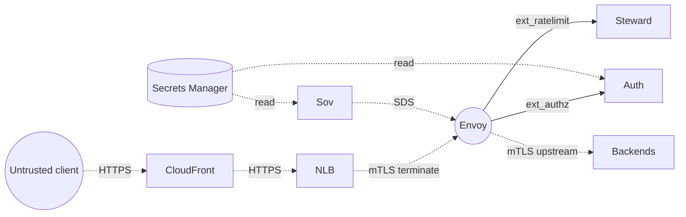

# Security posture

The platform's threat model, controls, and the trust boundaries it
draws between its parts.

## Trust boundaries

Each arrow is a boundary. Each terminator either authenticates the
other side or relies on a parent boundary that has.

## Controls

### Identity

- Every human or service principal authenticates via Keycloak OIDC.
- JWTs are short-lived (15 min) and refreshed via the device-code or
  client-credentials flow.
- The auth sidecar caches JWKS for 5 minutes with a 30s leeway on
  `exp`.

### Authorization

- Roles (`viewer`, `editor`, `admin`) come from the JWT's
  `realm_access.roles`.
- The auth sidecar forwards roles to the downstream filter chain via
  `x-regnant-roles`; backends can scope access from there.

### Transport

- mTLS between every mesh service via SDS-served leaf certificates.
- Leaves issued by the local root CA in the security module; rotated
  on every Terraform apply via the `tls_validity_hours` knob.
- Public TLS terminated at CloudFront / nginx; ACM certificate.

### Confidentiality at rest

- Five KMS customer-managed keys with auto-rotation: S3, DynamoDB,
  SQS, Secrets Manager envelope, CloudWatch Logs.
- S3 buckets refuse uploads without `aws:kms` SSE; bucket policies
  deny plaintext-HTTP entirely.

### Network

- VPC with public + private subnets per AZ.
- Security groups: ingress narrow, egress broad (LocalStack-friendly);
  production deployments tighten egress to known upstreams.
- VPC endpoints for S3, DynamoDB, SQS keep AWS API traffic off the
  internet.

### Defense in depth on the edge

- CloudFront / nginx adds HSTS, X-Content-Type-Options, X-Frame-Options,
  Referrer-Policy, XSS protection.
- Steward enforces per-product, per-tier rate limits backed by Redis.
- DDOS protection is CloudFront's responsibility (Shield Standard).

### Supply chain

- Every image signed with `sigstore/cosign` keyless OIDC.
- SPDX SBOM via `syft`, attached to every release.
- Trivy gate on HIGH/CRITICAL CVEs in the `trivy.yml` workflow.
- SLSA Level 2 provenance attached on tagged releases.

### Container baseline

- Distroless or chainguard final stage.
- Non-root user (UID >= 10000).
- `cap_drop: ALL` plus explicit `cap_add` only where required.
- `no-new-privileges:true`.
- Read-only root filesystem with tmpfs for ephemeral writes.

## Known limitations

- **Local CA**: browsers don't trust it. Production replaces the root
  with an organization-managed CA or AWS Private CA.
- **Demo passwords**: documented in `realm-export.json` and in
  `.env.example`. Override before any non-local deployment.
- **LocalStack IAM**: tagged-resource conditions are honored but IAM
  authorization is not enforced. Treat the IAM policies in the
  security module as documentation of intent.

## Audit hooks

- CloudWatch log groups per service with 30-day retention.
- Audit log archive bucket lifecycle: 30d -> IA, 90d -> Glacier,
  expires 365d.
- AppArmor profile on the Envoy binary inside the AMI; auditd captures
  identity changes, kernel module operations, mounts, exec, and time
  changes.
