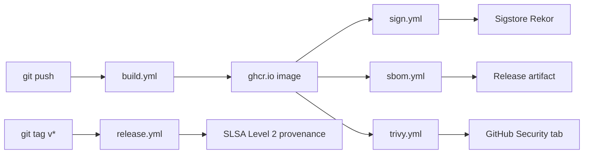

# Supply chain

Every container image and binary regnant produces is signed,
SBOM'd, and scanned. The pipeline is GitHub Actions; the policy is
expressed in `.github/workflows/`.

## Pipeline



## Signing

`cosign sign --yes <image>:<tag>` runs in `sign.yml` after `build.yml`
succeeds. Keyless OIDC is the default in CI (the OIDC token GH Actions
issues binds the signature to the workflow). A local keypair at
`security/cosign/cosign.key` is the fallback for offline builds.

Verify a release artifact:

```bash
cosign verify ghcr.io/gufranco/regnant/<image>:<tag> \
  --certificate-identity-regexp '^https://github\.com/gufranco/regnant/' \
  --certificate-oidc-issuer https://token.actions.githubusercontent.com
```

## SBOM

`anchore/sbom-action` runs `syft` against every image and produces
SPDX-JSON. Files land as workflow artifacts and as part of GitHub
release assets.

Generate locally:

```bash
make sbom
# or per-image:
syft ghcr.io/gufranco/regnant/osb-api:local -o spdx-json
```

## Vulnerability scanning

`aquasecurity/trivy-action` runs daily and on every build. The gate is
`HIGH,CRITICAL --exit-code 1`; lower severities are reported but do
not block. Results upload to the GitHub Security tab as SARIF.

Local scan:

```bash
make scan
trivy image --severity HIGH,CRITICAL regnant/envoy-fleet:local
```

## SLSA

`release.yml` calls `slsa-framework/slsa-github-generator` on tagged
releases. The generator produces an in-toto provenance attached as a
release asset and signed via Sigstore.

## Dependency hygiene

| Tool | Scope | Schedule |
|------|-------|----------|
| Renovate | Everything (Terraform, Docker, Python, Rust, Go) | Weekly group runs, automerge for patch |
| Dependabot | GitHub Actions + security alerts | Daily for security |
| `cargo-deny` | Rust supply chain (licenses, advisories, bans, sources) | Per push via lint workflow |
| `pip-audit` | Every Python project's installed deps | Per push via lint workflow |
| `govulncheck` | Go modules in tests/terratest | Per push via lint workflow |

## Provenance verification (consumer side)

A consumer of a regnant image can verify the full chain:

```bash
# 1. Signature
cosign verify ghcr.io/gufranco/regnant/cli:v0.1.0 \
  --certificate-identity-regexp '^https://github\.com/gufranco/regnant/' \
  --certificate-oidc-issuer https://token.actions.githubusercontent.com

# 2. SBOM
cosign download attestation ghcr.io/gufranco/regnant/cli:v0.1.0 \
  --platform linux/amd64 \
  --predicate-type https://spdx.dev/Document

# 3. SLSA provenance
cosign download attestation ghcr.io/gufranco/regnant/cli:v0.1.0 \
  --predicate-type https://slsa.dev/provenance/v1
```
